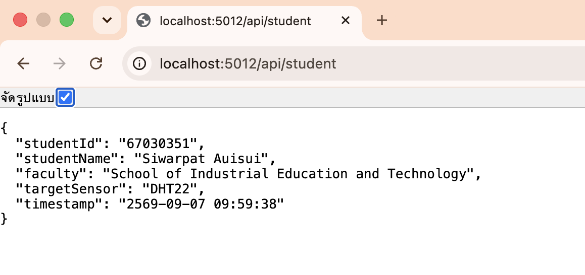
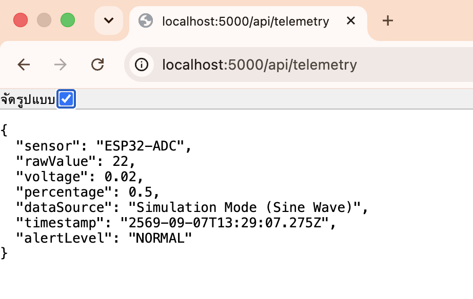
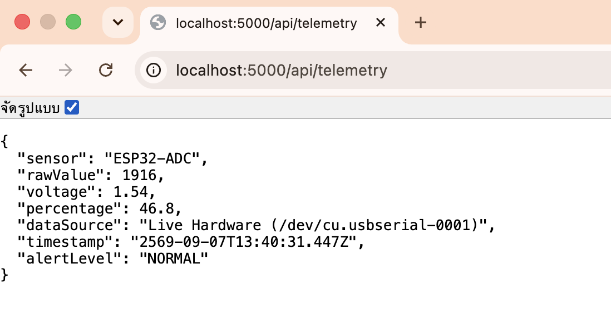
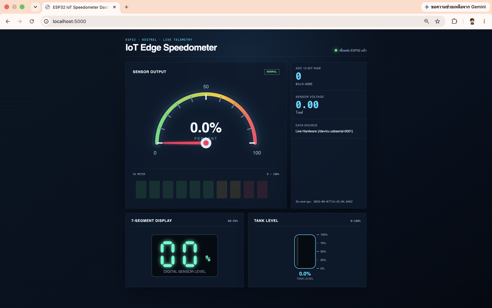
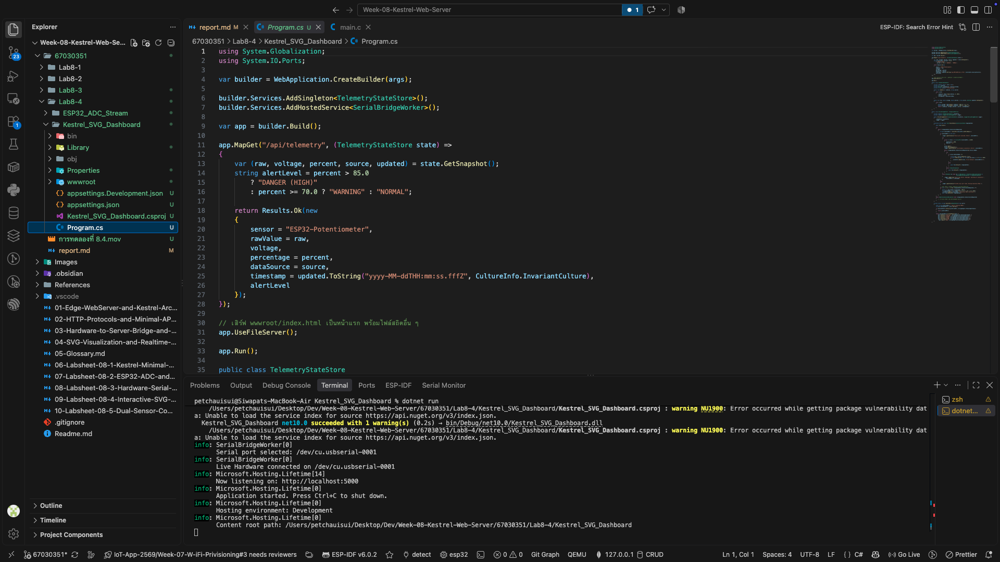
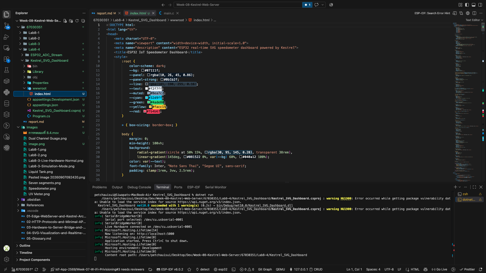
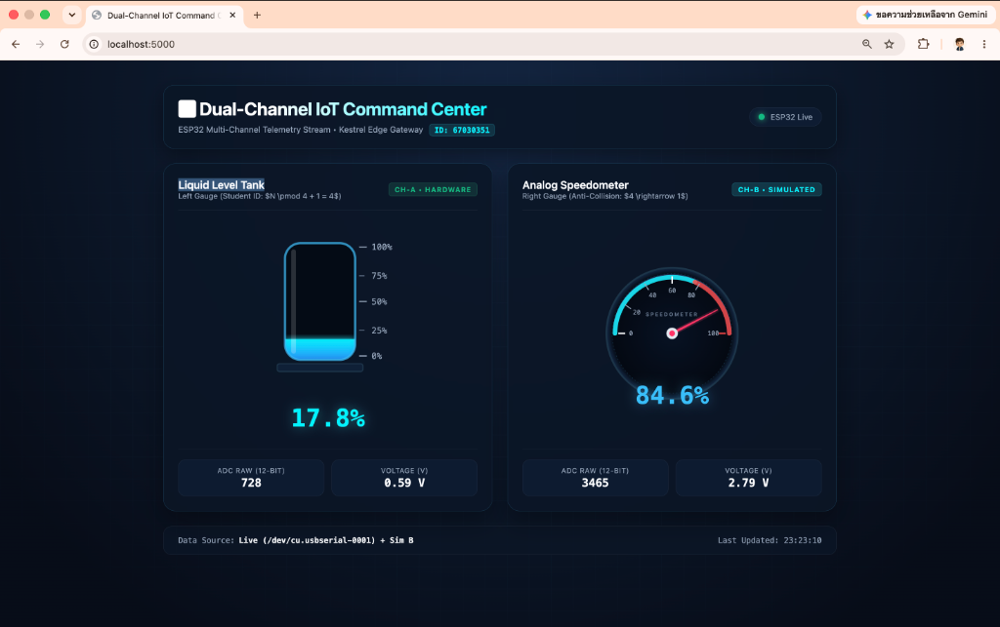
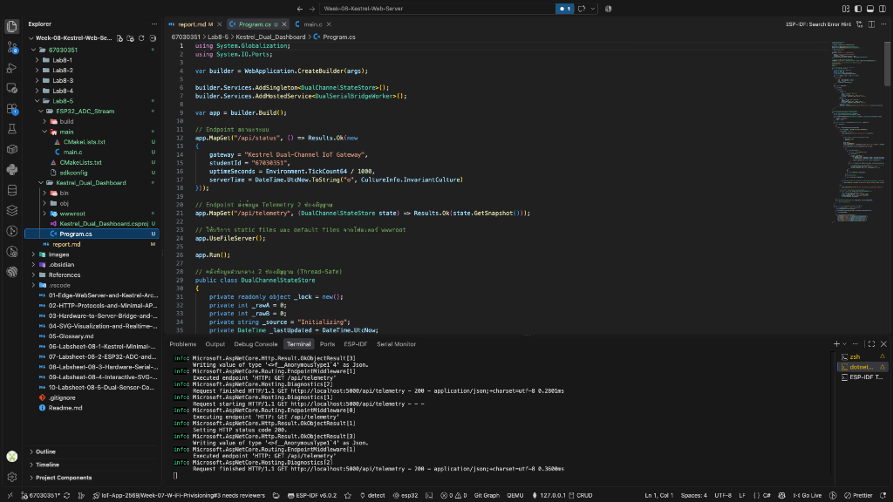
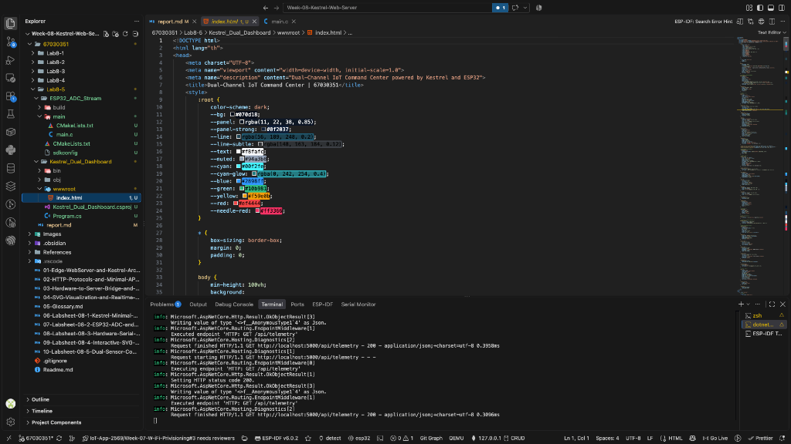

# ใบงานการทดลองที่ 8.1 พื้นฐาน Kestrel Web Server และ Minimal API
## [Checkpoint 1.1 ทดสอบความเข้าใจ]
1. ในหน้าจอ Terminal ขณะที่เซิร์ฟเวอร์กำลังรันอยู่ ให้กดปุ่ม `Ctrl + C` เพื่อหยุดโปรแกรม
2. กลับไปที่หน้าเบราว์เซอร์แล้วกดปุ่ม **Refresh (F5)** สังเกตว่าเกิดอะไรขึ้น และอธิบายสั้นๆ ว่าทำไมจึงเป็นเช่นนั้น
   - **คำตอบ** ไม่สามารถเข้าถึงเว็บไซต์นี้ localhost ปฏิเสธการเชื่อมต่อ
   
## ภารกิจท้าทาย (Micro-Challenge)

ให้นักศึกษาเขียน Endpoint ของตัวเองเพิ่มลงใน `Program.cs` ตามเงื่อนไขดังนี้

1. ตั้งชื่อ Path ว่า `/api/student`
2. เมื่อเปิดเข้าไปดู จะต้องคืนค่า JSON ที่มีข้อมูลดังต่อไปนี้
   - `studentId` = รหัสนักศึกษาของตนเอง (ชนิดสตริง)
   - `studentName`= ชื่อ-นามสกุลภาษาอังกฤษของตนเอง
   - `faculty`= คณะและสาขาวิชาที่กำลังศึกษา
   - `targetSensor`= ชื่อเซนเซอร์ที่ตนเองสนใจนำมาต่อกับ ESP32 ในวิชานี้ (เช่น "DHT22", "Potentiometer", "MQ-2")
   - `timestamp`= เวลาปัจจุบันของเซิร์ฟเวอร์ (`DateTime.Now.ToString(...)`)

 **หลักฐานการส่งงาน** บันทึกภาพหน้าจอเบราว์เซอร์ที่เปิดแสดงผล JSON จาก `/api/student` พร้อมโค้ดใน VS Code ลงในรายงานผลการทดลอง


---

## คำถามท้ายการทดลอง (Review Questions)
### 1. ในสถาปัตยกรรมของ Kestrel ตัวแปร `builder` ทำหน้าที่อะไร และตัวแปร `app` ทำหน้าที่อะไร

ตัวแปร `builder` ทำหน้าที่เตรียมและกำหนดค่าต่าง ๆ ที่จำเป็นสำหรับ Web Application ก่อนเริ่มทำงาน เช่น การตั้งค่า Web Server, Services, Configuration และ Logging

ส่วนตัวแปร `app` คือ Web Application ที่สร้างเสร็จจาก `builder` แล้ว ใช้สำหรับกำหนด Endpoint หรือ Route ต่าง ๆ เช่น `MapGet()` รวมถึงใช้เริ่มต้นให้ Web Server ทำงานด้วย `app.Run()`

สรุปคือ `builder` ใช้สำหรับ **เตรียมและตั้งค่าระบบ** ส่วน `app` ใช้สำหรับ **กำหนดการทำงานของ Web Application และรับคำขอจาก Client**

---

### 2. เปรียบเทียบความสะดวกระหว่างการสร้าง Web Server บน .NET Minimal API กับการรันผ่าน LAMP Stack (Apache + PHP) ว่ามีข้อดีข้อเสียต่างกันอย่างไรในมุมมองของงาน IoT Gateway

.NET Minimal API มีความสะดวกในการสร้าง Web API เพราะสามารถเขียน Endpoint ได้ด้วยโค้ดเพียงไม่กี่บรรทัด และมี Kestrel Web Server อยู่ในตัว จึงไม่จำเป็นต้องติดตั้งและตั้งค่า Apache เพิ่ม เหมาะกับงาน IoT Gateway ที่ต้องรับส่งข้อมูลกับ Sensor, ESP32 หรืออุปกรณ์ต่าง ๆ ผ่าน HTTP และ JSON รวมถึงสามารถพัฒนาต่อยอดเป็นระบบที่ซับซ้อนได้ง่าย

ส่วน LAMP Stack ซึ่งประกอบด้วย Linux, Apache, MySQL และ PHP เป็นเทคโนโลยีที่ใช้งานแพร่หลายและเหมาะกับการสร้างเว็บไซต์หรือระบบที่เชื่อมต่อฐานข้อมูล แต่ต้องติดตั้งและตั้งค่าหลายส่วนมากกว่า เช่น Apache และ PHP ทำให้การเริ่มต้นระบบอาจมีขั้นตอนมากกว่า Minimal API

ดังนั้น สำหรับงาน IoT Gateway ขนาดเล็กถึงกลาง .NET Minimal API มีข้อดีคือ **เริ่มต้นง่าย โค้ดกระชับ และเหมาะกับการสร้าง API** ขณะที่ LAMP Stack มีข้อดีในเรื่องความแพร่หลายและการรองรับระบบเว็บไซต์แบบดั้งเดิม แต่มีองค์ประกอบที่ต้องจัดการมากกว่า

---
### 3. นักศึกษาคิดว่าการเพิ่ม `/api/` เข้าไปใน route นั้นมีประโยชน์อย่างไรบ้าง ถ้าไม่ใส่จะเกิดปัญหาอะไรบ้าง

การเพิ่ม `/api/` ไว้ด้านหน้าของ Route เช่น `/api/status`, `/api/led/on` และ `/api/student` ช่วยให้สามารถแยก Endpoint ที่ใช้สำหรับรับส่งข้อมูลออกจากหน้าเว็บไซต์ทั่วไปได้อย่างชัดเจน ทำให้โครงสร้างของระบบเป็นระเบียบ อ่านและดูแลรักษาง่าย และช่วยให้ผู้พัฒนารู้ได้ทันทีว่า Route นั้นเป็นส่วนของ API

หากไม่ใส่ `/api/` ระบบยังสามารถทำงานได้ตามปกติ เช่น `/status` หรือ `/student` แต่เมื่อระบบมี Route จำนวนมากขึ้น อาจทำให้ Route ของ API ปะปนกับ Route ของหน้าเว็บไซต์ เช่น `/home`, `/login` หรือ `/student` และอาจเกิดชื่อ Route ซ้ำหรือสร้างความสับสนในการพัฒนาได้

ดังนั้น การใช้ `/api/` จึงไม่ได้เป็นข้อบังคับทางเทคนิค แต่เป็นแนวทางที่ช่วยให้ โครงสร้าง Route ชัดเจน เป็นระเบียบ และรองรับการขยายระบบในอนาคตได้ง่ายขึ้น

---

# ใบงานการทดลองที่ 8.2 การสตรีมสัญญาณแอนะล็อก ESP32 ออกพอร์ตสื่อสารอนุกรม (UART)
## [Checkpoint 2.1 ทดสอบความเข้าใจ]

1. ใน ESP-IDF v6.x ฟังก์ชัน `adc_oneshot_read()` คืนค่าผลลัพธ์เป็นตัวเลขแบบใด และมีช่วงค่าต่ำสุด-สูงสุดเท่าใดเมื่อตั้งค่าเป็น `ADC_BITWIDTH_12`
   - **คำตอบ:** ค่าที่อ่านได้เป็นค่าดิจิทัลดิบ (Raw ADC) ชนิดจำนวนเต็ม `int` โดยเมื่อตั้งค่าเป็น `ADC_BITWIDTH_12` จะมี 2^12 = 4,096 ระดับ ตั้งแต่ **0 ถึง 4,095** ซึ่งยังไม่ใช่ค่าแรงดันหน่วยโวลต์โดยตรง ทั้งนี้ ฟังก์ชัน `adc_oneshot_read()` ส่งค่า ADC ผ่านตัวแปรที่ส่งที่อยู่เข้าไป เช่น `&raw_val` ส่วนค่าที่ฟังก์ชันคืนโดยตรงเป็นรหัสสถานะชนิด `esp_err_t` เช่น `ESP_OK` เมื่ออ่านสำเร็จ
2. ทำไมเราจึงต้องกดปุ่ม `Ctrl + ]` เพื่อปิด **ESP-IDF Monitor** ก่อนที่เราจะรันโปรแกรมฝั่ง C# Kestrel ในใบงานถัดไป
   *(คำใบ้: หากโปรเซส idf.py monitor ยังเปิดค้างอยู่ จะเกิดอะไรขึ้นกับพอร์ต COM)*
   - **คำตอบ:** ต้องกด `Ctrl + ]` เพื่อปิด ESP-IDF Monitor และคืนพอร์ต COM ให้โปรแกรมอื่นใช้งาน เพราะขณะที่ Monitor เปิดอยู่จะครอบครองพอร์ตอนุกรมนั้น หากโปรแกรม C# Kestrel พยายามเปิดพอร์ตเดียวกันผ่าน `SerialPort` จะเปิดไม่ได้ และอาจเกิดข้อผิดพลาดว่าพอร์ตถูกใช้งานอยู่หรือถูกปฏิเสธการเข้าถึง เช่น `UnauthorizedAccessException` ดังนั้นต้องปิด Monitor ก่อน เพื่อให้โปรแกรม C# เปิดพอร์ตและรับข้อมูลจาก ESP32 ได้

## ภารกิจท้าทาย (Micro-Challenge): การอ่านค่าความเข้มแสงด้วย LDR
- ให้นักศึกษาทดลองเปลี่ยนตัวต้านทานปรับค่าได้เป็น **LDR (Light Dependent Resistor)** ร่วมกับตัวต้านทาน $10\text{ k}\Omega$ แบ่งแรงดัน
- ทดลองใช้ไฟฉายจากโทรศัพท์มือถือส่อง และเอามือปิดบังแสง สังเกตค่า ADC บนหน้าจอเทอร์มินัลว่าเปลี่ยนแปลงอย่างไร
- บันทึกภาพถ่ายการต่อวงจรและภาพหน้าจอ Monitor ลงในรายงานผลการทดลอง

### ภาพวงจร
```
3.3V ── LDR ── GPIO34 ── 10 kΩ ── GND
```


### ผลการทดลอง
```
I (274) main_task: Calling app_main()

[SYSTEM] ESP-IDF v6.x Potentiometer Stream Starting...
[SYSTEM] ADC Initialized. Streaming EMA filtered values at 20 Hz @ 115200 bps...
655
1131
1497
1792
2007
2169
2289
2357
2407
2453
2503
2517
2549
2569
2598
2601
2591
2599
2617
2619
2623
2607
2607
2611
2620
2605
2579
2564
2546
2534
2502
2486
2460
2449
2436
2440
2434
2426
2411
2413
2395
2401
2389
2373
2367
2360
2353
2371
2371
2374
2368
2366
2354
2352
2336
2325
2319
2507
2762
3023
3223
3410
3521
3615
3706
3762
3824
3886
3915
3942
3980
3996
4020
4039
4053
4059
4068
4062
4070
4066
4071
4077
4080
4084
4086
4088
4090
4091
4092
4093
4092
4091
4080
4084
4076
4081
4084
4087
4089
4090
4091
4081
4084
4087
4048
3992
3882
3626
3400
3226
2981
2780
2659
2582
2540
2544
2544
2539
2550
2562
2576
2569
2572
2579
2574
2596
2593
2594
2601
2590
2598
2596
2607
2603
2608
2590
2577
```

# ใบงานการทดลองที่ 8.3 สะพานเชื่อมฮาร์ดแวร์จริงสู่เว็บเซิร์ฟเวอร์ (Hardware Serial Bridge)
## 📋 [Checkpoint 3.1: ทดสอบกลไก Fallback Simulation]
1. ขณะที่โปรแกรม C# กำลังรันอยู่ ให้ถอดสาย USB ของ ESP32 ออกจากคอมพิวเตอร์
2. กด Refresh (F5) บนหน้าเบราว์เซอร์หลายๆ ครั้งติดต่อกัน สังเกตว่า:
   - ค่า `dataSource` เปลี่ยนเป็นอะไร?
   - ค่า `rawValue` ยังเปลี่ยนได้อยู่หรือไม่ และเปลี่ยนในลักษณะใด?
   - **คำตอบ:** เมื่อถอดสาย USB ของ ESP32 ค่า `dataSource` จะเปลี่ยนเป็น `Simulation Mode (Sine Wave)` แสดงว่า Background Worker ไม่สามารถเชื่อมต่อกับฮาร์ดแวร์ได้และสลับเข้าสู่โหมดจำลองอัตโนมัติ ค่า `rawValue` ยังคงเปลี่ยนแปลงได้แม้ไม่มี ESP32 โดยเปลี่ยนขึ้นและลงอย่างต่อเนื่องในช่วงประมาณ 0–4095 ตามรูปคลื่นไซน์ที่โปรแกรมสร้างจากเวลา ส่งผลให้ค่า `voltage` และ `percentage` เปลี่ยนตามไปด้วย ระบบจึงยังให้บริการ `/api/telemetry` ได้โดยไม่หยุดทำงาน แม้จะถอดบอร์ดออก <br>
   

## 🎯 ภารกิจท้าทาย (Micro-Challenge)
- ให้นักศึกษาเพิ่มฟิลด์ `alertLevel` เข้าไปในผลลัพธ์ JSON ของ `/api/telemetry`:
  - ถ้า `percentage` มากกว่า 85.0% ให้ส่งค่า `"DANGER (HIGH)"`
  - ถ้า `percentage` ระหว่าง 70.0% - 85.0% ให้ส่งค่า `"WARNING"`
  - ถ้า `percentage` ต่ำกว่า 70.0% ให้ส่งค่า `"NORMAL"`
- บันทึกภาพหน้าจอเบราว์เซอร์ขณะหมุนไปที่ระดับต่างๆ เพื่อแสดงว่าฟิลด์ `alertLevel` ทำงานถูกต้อง

### ผลการทดลองกับฮาร์ดแวร์จริง

เมื่อเชื่อมต่อ ESP32 ผ่านพอร์ต `/dev/cu.usbserial-0001` และเรียกดู `/api/telemetry` พบว่าระบบรับข้อมูลจากบอร์ดได้สำเร็จ โดยมีผลการอ่านดังนี้

| รายการ | ผลที่อ่านได้ |
| --- | --- |
| แหล่งข้อมูล | `Live Hardware (/dev/cu.usbserial-0001)` |
| ค่า ADC (`rawValue`) | 1916 |
| แรงดัน (`voltage`) | 1.54 V |
| เปอร์เซ็นต์ (`percentage`) | 46.8% |
| ระดับแจ้งเตือน (`alertLevel`) | `NORMAL` |

ค่า `percentage` เท่ากับ 46.8% ซึ่งต่ำกว่า 70.0% ระบบจึงกำหนด `alertLevel` เป็น `NORMAL` ได้ถูกต้องตามเงื่อนไข แหล่งข้อมูลแสดงเป็น `Live Hardware` ยืนยันว่าค่าดังกล่าวมาจาก ESP32 จริง ไม่ใช่ข้อมูลจำลอง




# ใบงานการทดลองที่ 8.4 แดชบอร์ดมาตรวัดความเร็ว SVG และสนามทดลองสร้างสรรค์ (Creative Playground)
## ผลการประกอบและทดสอบระบบ

- ภาพหน้าจอ Dashboard ขณะรับข้อมูลจาก ESP32:

- ภาพหน้าจอซอร์สโค้ด `Program.cs` และ `wwwroot/index.html`
   - Program.cs
   
   - wwwroot/index.html
   
- วิดีโอความยาว 15–30 วินาทีที่เห็นการหมุน Potentiometer และเข็ม Speedometer หรือ VU Meter เคลื่อนตาม:
  - 🔗 [▶️ **คลิกเพื่อเปิดดูวิดีโอคลิปการทดลองที่ 8.4 (Google Drive)**](https://drive.google.com/file/d/1dMocYAoY6k2qHQAmxY3ayCKrJEBS37RI/view?usp=sharing)

# ใบงานการทดลองที่ 8.5 ศูนย์ควบคุมเซนเซอร์คู่ IoT แบบเรียลไทม์ (Dual-Channel IoT Command Center)

### ผลการคำนวณชนิดหน้าปัดเฉพาะบุคคล (Student-ID Gauge Assignment)
รหัสนักศึกษา: **67030351** (เลข 3 ตัวท้าย $N = 351$)

1. **เกจ์ซ้าย (Channel A - Live Hardware Potentiometer)**:
   $$\text{Left} = (351 \pmod 4) + 1 = 3 + 1 = \mathbf{4}$$
   👉 **ชนิดเกจ์ที่ได้: หมายเลข 4 — Liquid Level Tank (ถังของเหลวอุตสาหกรรม)**

2. **เกจ์ขวา (Channel B - Simulated Sensor)**:
   $$\text{Right}_{\text{initial}} = (\lfloor 351 / 4 \rfloor \pmod 4) + 1 = (87 \pmod 4) + 1 = 3 + 1 = 4$$
   เนื่องจากผลลัพธ์ซ้ำกับเกจ์ซ้าย ($\text{Left} = 4$) จึงใช้ **กฎป้องกันเกจ์ซ้ำ (Anti-Collision Rule)**:
   $$\text{Right} = (4 \pmod 4) + 1 = \mathbf{1}$$
   👉 **ชนิดเกจ์ที่ได้: หมายเลข 1 — Analog Speedometer (หน้าปัดเข็มไมล์กวาดมุมองศา)**

---

### ผลการประกอบและทดสอบระบบ

- **ภาพหน้าจอแดชบอร์ดคู่ (Dual-Channel Dashboard)** ขณะรับข้อมูลจาก ESP32 (CH-A: Liquid Tank และ CH-B: Speedometer):



#### ตารางบันทึกค่า Telemetry ขณะทดสอบระบบ
| พารามิเตอร์ | ช่องสัญญาณ A (เกจ์ซ้าย) | ช่องสัญญาณ B (เกจ์ขวา) |
| :--- | :--- | :--- |
| **ชนิดของเกจ์** | **Liquid Level Tank** | **Analog Speedometer** |
| **แหล่งที่มาของข้อมูล** | ฮาร์ดแวร์จริง (ESP32 Potentiometer) | สัญญาณจำลองทางคณิตศาสตร์ (Simulation Wave) |
| **ค่า ADC ดิบ (`rawValue`)** | `728` | `3465` |
| **แรงดันไฟฟ้า (`voltage`)** | `0.59 V` | `2.79 V` |
| **เปอร์เซ็นต์ (`percentage`)** | `17.8%` | `84.6%` |
| **สถานะระบบ (`dataSource`)** | `Live (/dev/cu.usbserial-0001) + Sim B` | `Live (/dev/cu.usbserial-0001) + Sim B` |

- **ภาพหน้าจอซอร์สโค้ด `Program.cs` และ `wwwroot/index.html`**:
  - `Program.cs`
  
  - `wwwroot/index.html`
  

- **วิดีโอสาธิตการทำงาน (15–30 วินาที)**:
  - 🔗 [▶️ **คลิกเพื่อเปิดดูวิดีโอคลิปการทดลองที่ 8.5 (Google Drive)**](https://drive.google.com/file/d/1HQl6c2DJd2q7Udaj4r4FAWW9P3DWwtp9/view?usp=sharing)

---

### สรุปหลักการทำงานและผลการทดลอง
1. **การจัดการข้อมูลหลายช่องสัญญาณ (Multi-Channel Telemetry Architecture)**:
   - คลาส `DualChannelStateStore` ถูกออกแบบให้เป็น Thread-Safe Singleton โดยใช้กลไก `lock (_lock)` ในการเขียนและอ่าน เพื่อให้ `DualSerialBridgeWorker` ที่รันเป็น Background Service และ Kestrel Request Handler ของ Endpoint `/api/telemetry` สามารถเข้าถึงข้อมูลของทั้ง `channelA` และ `channelB` ได้พร้อมกันโดยไม่มีปัญหา Race Condition
2. **การเชื่อมต่อและดักฟัง Serial Port**:
   - `DualSerialBridgeWorker` สแกนหาพอร์ต ESP32 (เช่น `/dev/cu.usbserial-0001` บน macOS) เพื่อรับข้อมูล ADC 12-bit จากฮาร์ดแวร์จริงนำเข้า Channel A พร้อมจำลองสัญญาณ Sine Wave เข้าสู่ Channel B แบบเรียลไทม์ และมีระบบ Fallback ไปยัง Simulation Mode อัตโนมัติเมื่อถอดสาย USB
3. **การแสดงผลและการอัปเดตแบบ Dynamic SVG**:
   - เกจ์ซ้าย **Liquid Level Tank** คำนวณความสูงของของเหลวและพิกัดแกน Y: `fillHeight = (pct / 100.0) * 150` และ `fillY = 170 - fillHeight`
   - เกจ์ขวา **Analog Speedometer** คำนวณมุมกวาดของเข็มไมล์: `angle = -90 + (pct / 100.0) * 180`
   - ฝั่งเว็บเบราว์เซอร์ใช้ JavaScript ดึงข้อมูล JSON ผ่าน `setInterval(pollTelemetry, 120)` ทำให้หน้าปัดทั้งสองตอบสนองอย่างรวดเร็ว ลื่นไหล และตรงตามเงื่อนไขเฉพาะบุคคลของรหัสนักศึกษาอย่างสมบูรณ์

